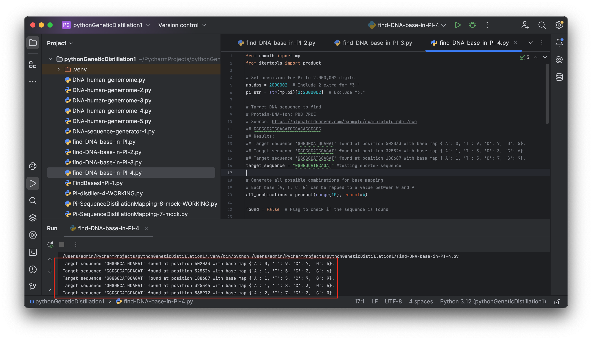
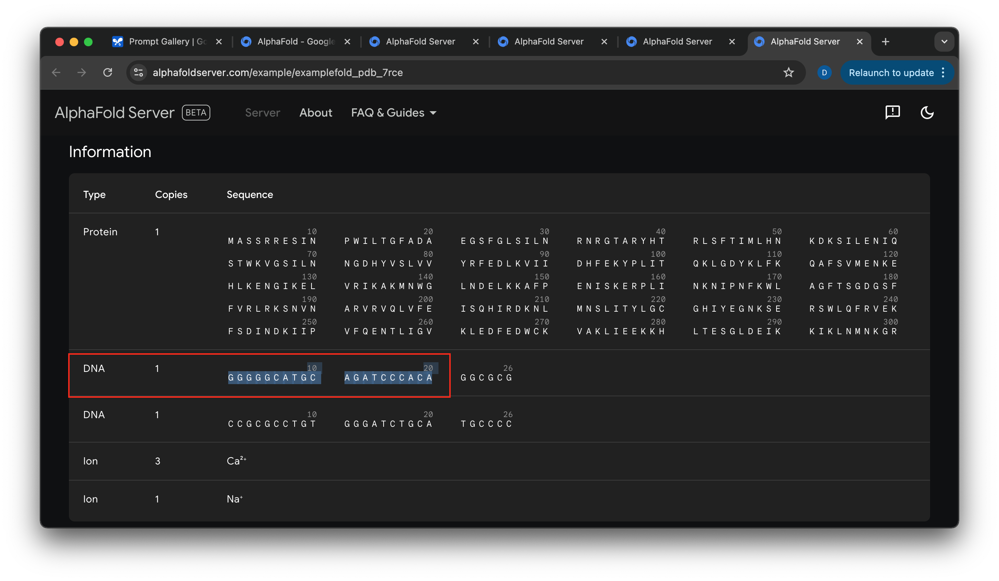

# DNA Pi Patterns Finder

- Dare to Dream
- Inspire Bold Leadership
- Embrace Diversity in Thought and Innovation
- Explore together & unlock the world's knowledge

------------------------------------

This approach explores how DNA sequences can be found within the digits of Pi. Using a dynamic mapping system, each DNA base (A, T, C, G) is assigned unique integer values between 0 and 9. The algorithm systematically generates all possible mappings for these bases, iterating through 10^4 combinations to explore every permutation. For each mapping, the decimal digits of Pi, calculated to over 2,000,000 places, are converted into a DNA sequence.

Finding a DNA sequence within the digits of Pi is significant because it uncovers the possibility of hidden patterns and connections between mathematics and biology. Pi, a transcendental and infinite number, is known for its randomness, yet by mapping Pi’s digits to DNA bases, we explore the idea that complex biological sequences could exist within this mathematical constant. This exploration could offer insights into the fundamental structure of genetic code, suggesting that patterns of life might be encoded not only in biological systems but also in the very fabric of mathematics. This innovative approach bridges fields like mathematics, genetics, and computational science, inspiring new ways of thinking about information storage, genetic research, and even encryption.

*sample DNA source: https://alphafoldserver.com/example/examplefold_pdb_7rce*